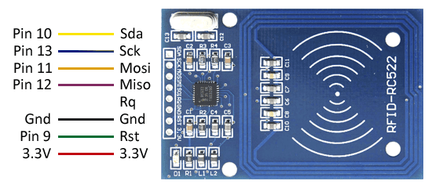
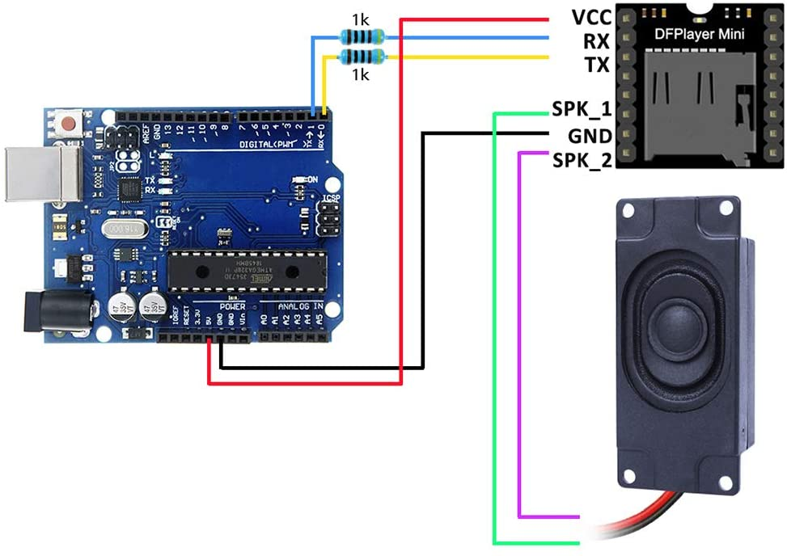

# This is the Documentation for the Project.

### We begin by describing the general structure and wiring and the circuit diagram.

First of all the Components which are being used include:

- An Arduino Nano 33 IoT with Headers
- A RFID-RC522 Reader Chip (pins must be soldered)
- Speaker for the Arduino
- An DfPlayer Mini Audio Encoder
- Various wiring components, resistors etc.

The electrical circuit for the RFID-RC522 Reader with the Arduino is displayed here:

The electrical circuit for the Speaker Configuration is set up as follows:

